# randomMountains
Randomly colored generic mountain landscape.

## Working example:
https://matthias-jaeger-net.github.io/randomMountains/

## Screenshots
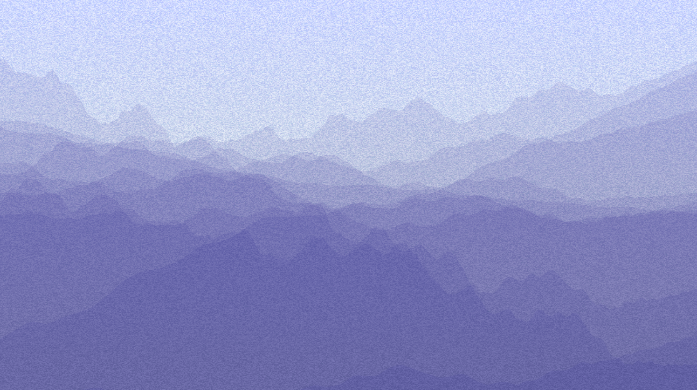
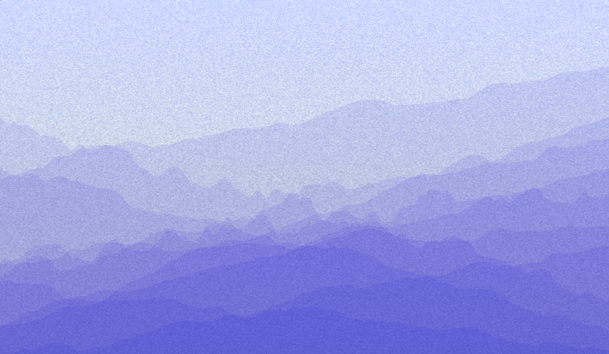
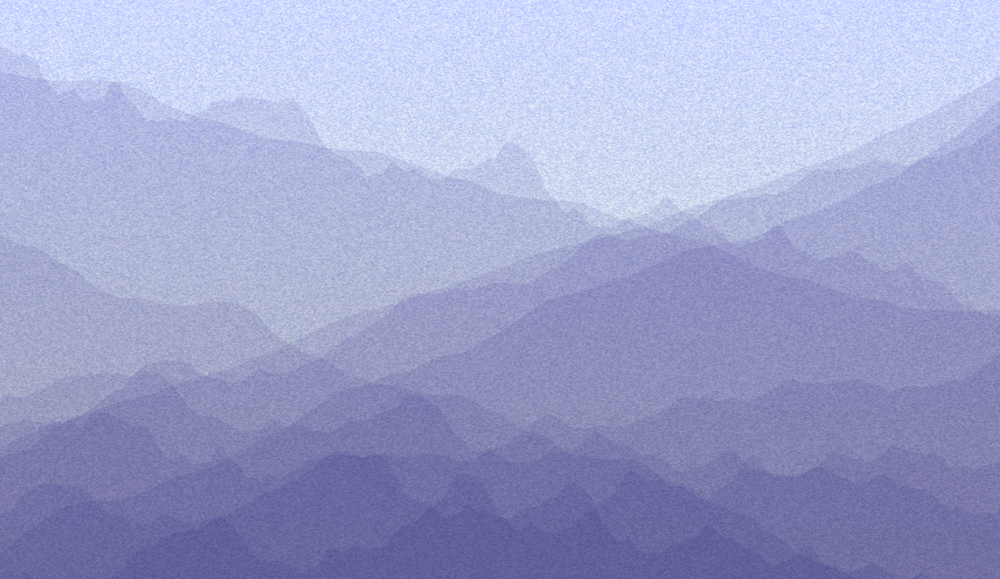
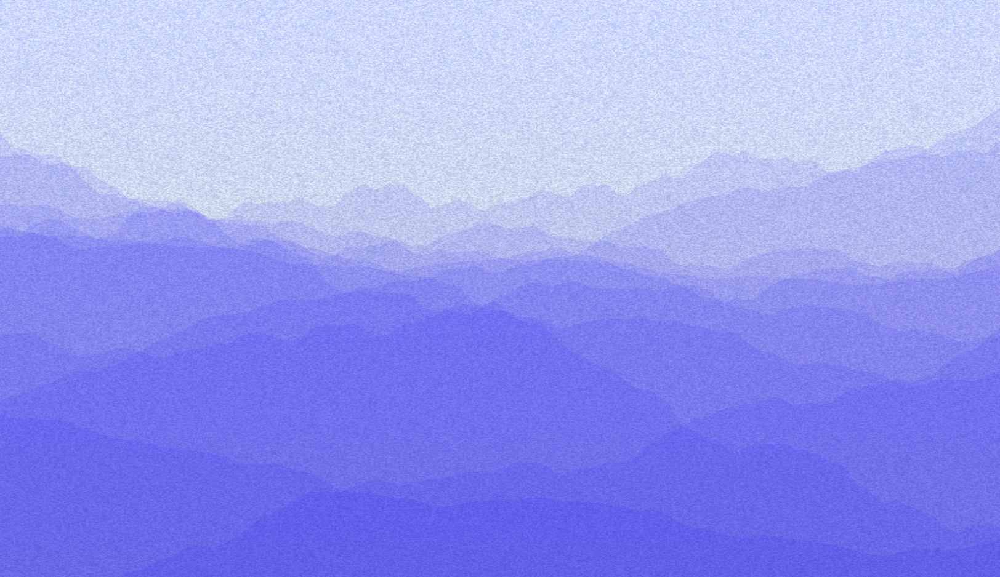
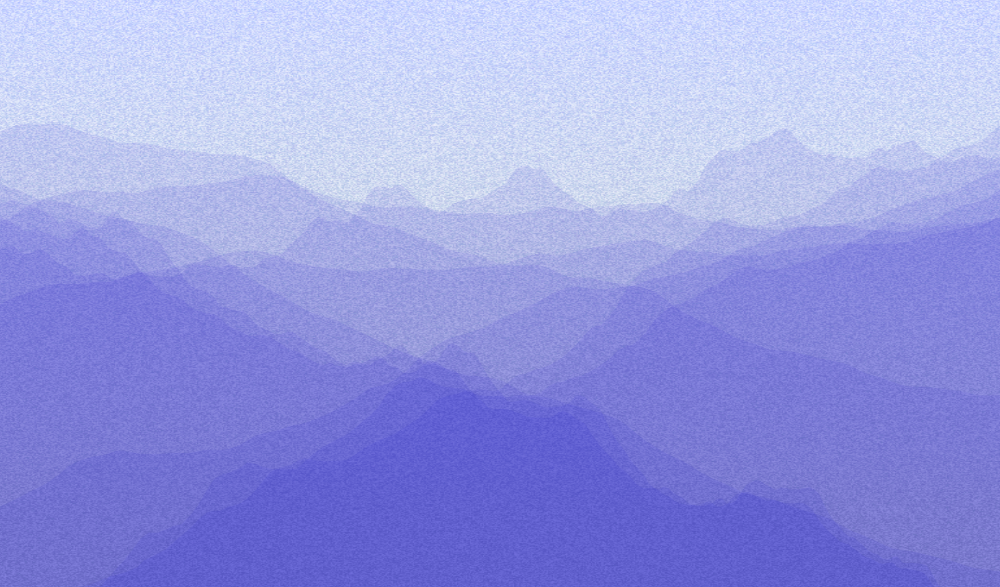
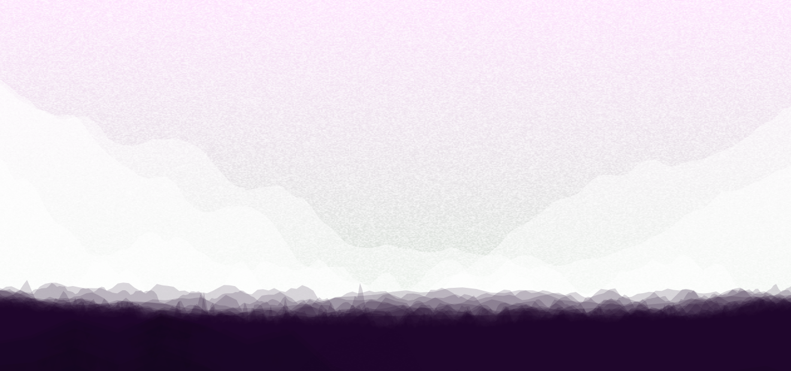
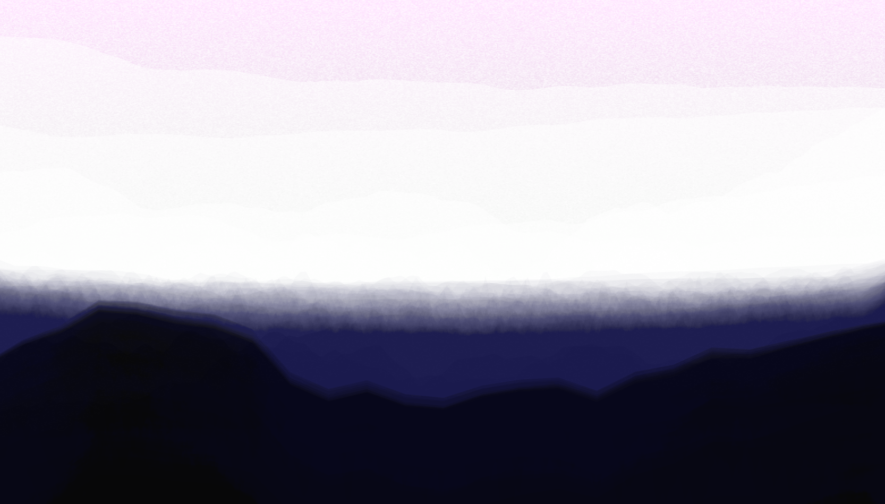
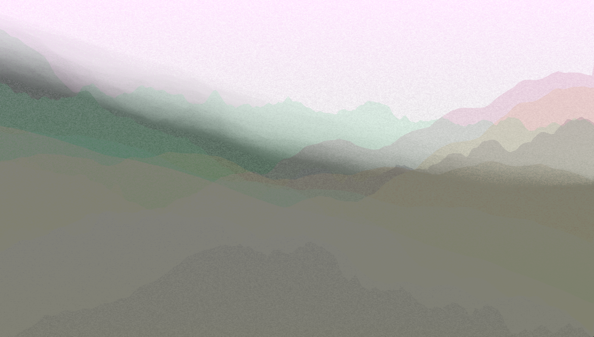
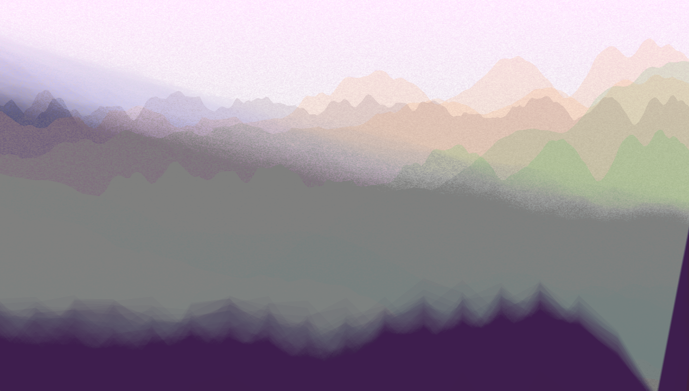

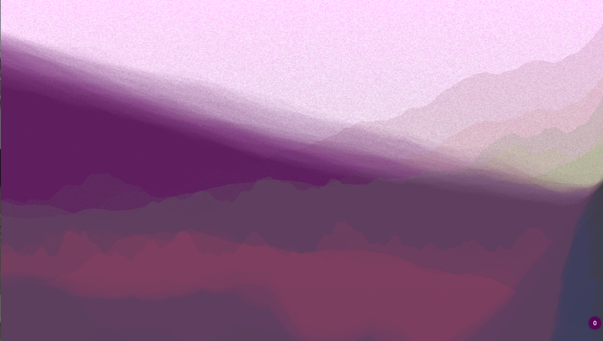

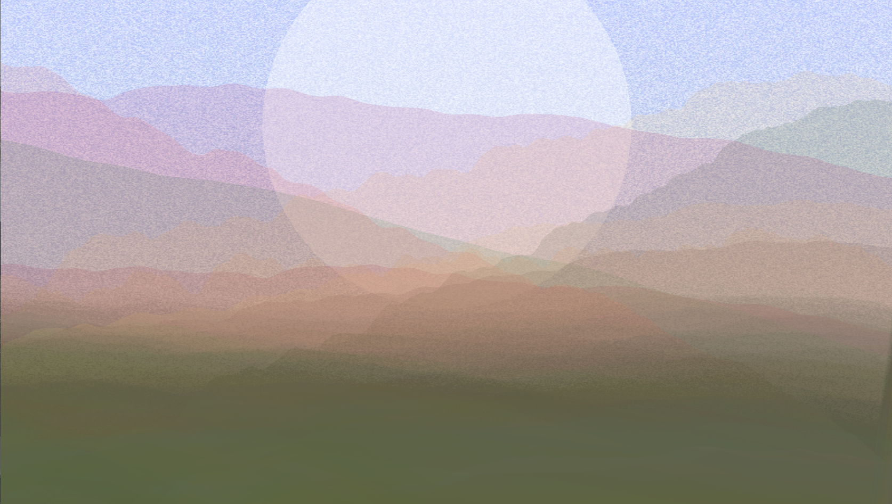
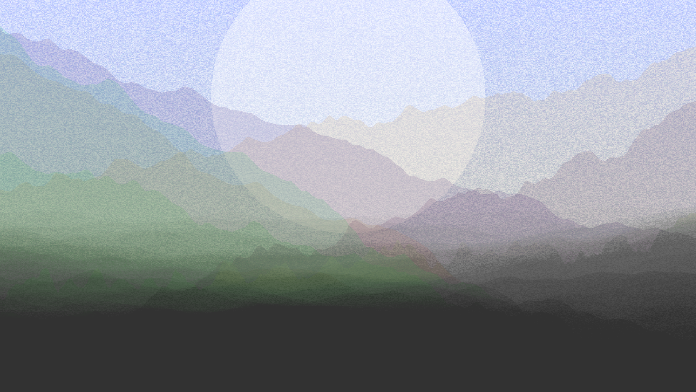
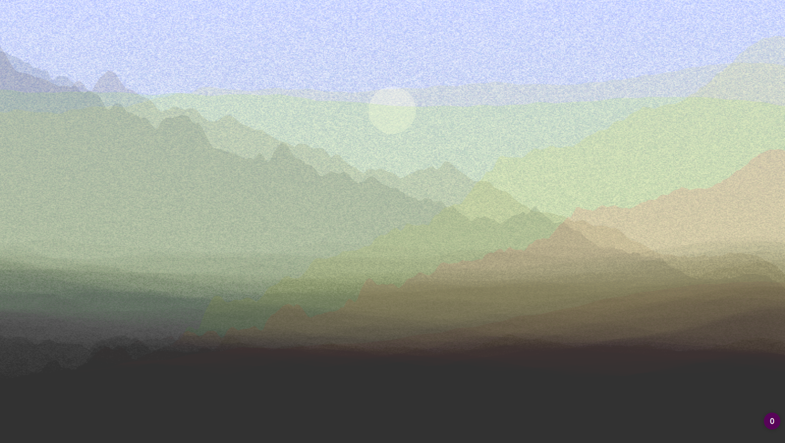

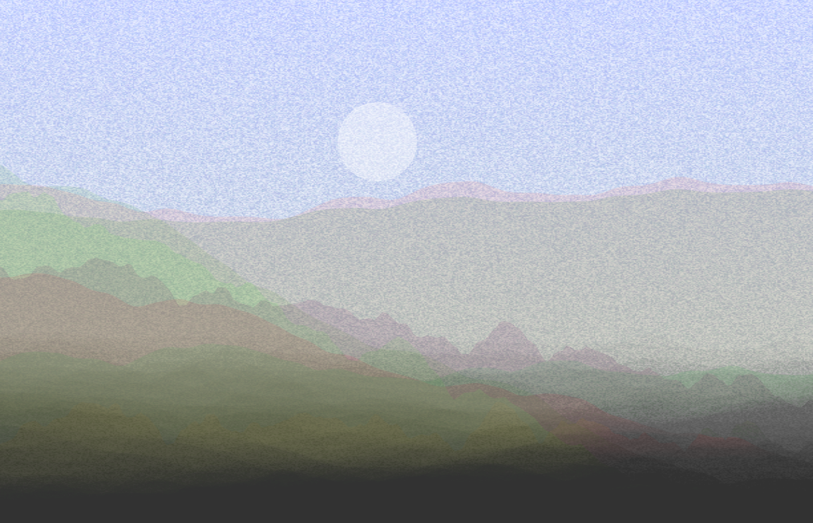
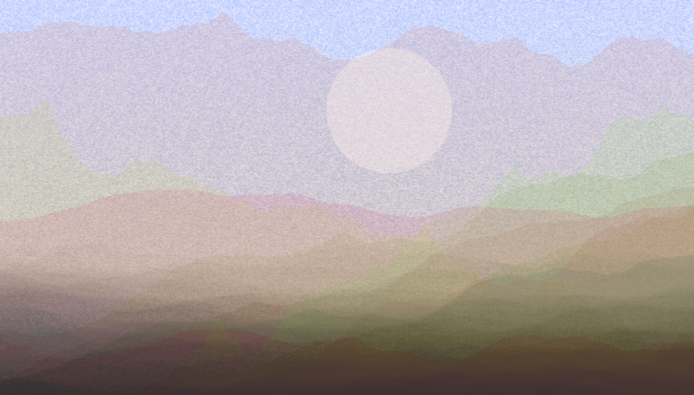

### Rendering with p5js:  
http://p5js.org/
